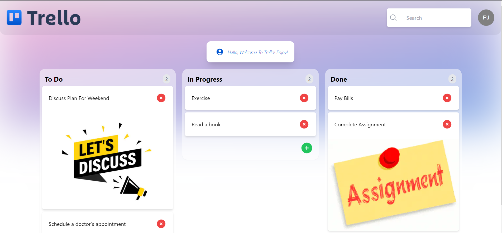

# Trello-Appwrite


## Description

Trello-Appwrite is a Trello clone built using Next.js and Appwrite backend. It allows users to create boards, lists, and cards to organize their tasks and projects effectively.



## Table of Contents

- [Demo](#demo)
- [Installation](#installation)
- [Usage](#usage)
- [Features](#features)
- [Technologies](#technologies)
- [Contact](#contact)

## Demo

#### [Live link](https://trello-appwrite-clone-parasjogani.vercel.app/)

## Installation

To run Trello-Appwrite locally, follow these steps:

1. Clone the repository:

```bash
git clone https://github.com/parasjogani/trello-appwrite.git
```

2. Change into the project directory:
```bash
cd trello-appwrite
```

3. Install all dependencies:
```bash
npm install
```

4. Create a `.env.local` file in the root directory and add the following environment variables:
```
NEXT_PUBLIC_APPWRITE_PROJECT_ID= YOUR_PROJECT_ID
NEXT_PUBLIC_DATABASE_ID= YOUR_DATABASE_ID
NEXT_PUBLIC_TODOS_COLLECTION_ID= YOUR_TODOS_COLLECTION_ID
NEXT_PUBLIC_BUCKET_ID= YOUR_BUCKET_ID
```
Replace YOUR_PROJECT_ID, YOUR_DATABASE_ID, YOUR_TODOS_COLLECTION_ID, and YOUR_BUCKET_ID with your Appwrite backend details.

5. Run the development server:
```
npm start
```

## Usage

1. **Task Management with Visuals:** This TODO app allows users to add tasks with image attachments, providing a visual representation of their to-dos for enhanced clarity and organization.

2. **Seamless Task Progression:** Tasks in the app can be easily dragged and dropped from the "TODO" column to the "In Progress" and "Done" columns, enabling effortless tracking and management of task progression.

3. **Efficient and Intuitive Workflow:** With its user-friendly interface and intuitive features, the app streamlines task management, empowering users to stay productive and focused on completing their tasks effectively.

## Features

1. **Task Creation with Image Attachment:** Users can create tasks and attach relevant images to provide visual context or additional information related to the task.

2. **Drag-and-Drop Task Management:** Tasks can be easily moved between columns (e.g., from "TODO" to "In Progress" and "Done") by using a simple drag-and-drop gesture, allowing users to update task status effortlessly.

3. **Search and Filter:** The app include a search and filtering feature, allowing users to quickly find specific tasks based on keywords.

4. **Task Completion:** Completed tasks can be marked as "done" or you can delete it, keeping the active task list clutter-free.

## Technologies
HTML

CSS

TypeScript

Node.js

Appwrite

Vercel - For Deployment

## Contact
Email : paras.jogani@gmail.com

LinkedIn: https://www.linkedin.com/in/paras-jogani/